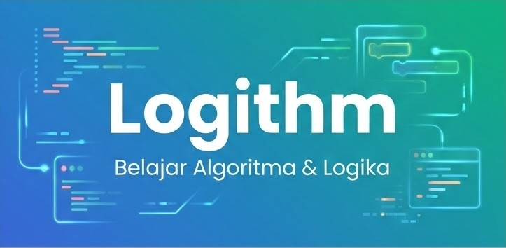
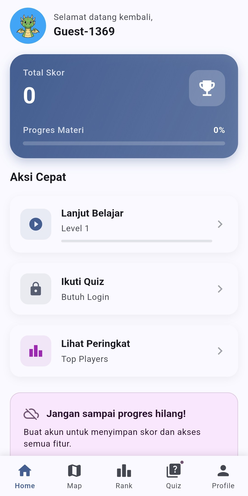
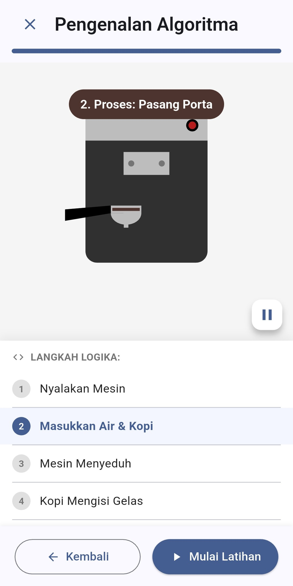
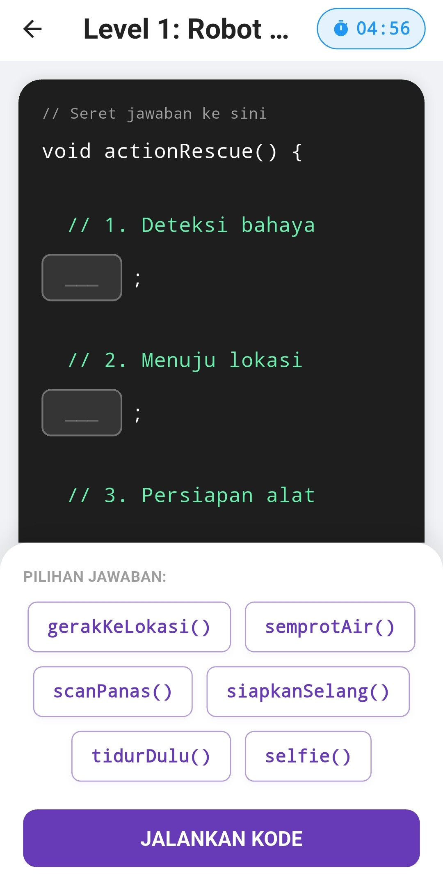

# Logithm - Sistem Simulasi Percabangan & Pengulangan

 

**Logithm** adalah aplikasi pembelajaran berbasis Android yang dirancang untuk membantu mahasiswa Teknik Informatika memahami konsep dasar algoritma, khususnya **Percabangan (Branching)** dan **Pengulangan (Looping)**.

Aplikasi ini dibangun menggunakan **Flutter** dan **Supabase** sebagai Tugas Akhir D3 Teknik Informatika Politeknik Kampar.

## 📱 Fitur Utama
* **Materi Interaktif:** Penjelasan visual mengenai if-else, switch-case, for, while, dan do-while.
* **Simulasi Algoritma:** Pengguna dapat memasukkan input dan melihat bagaimana algoritma memprosesnya langkah demi langkah.
* **Kuis & Evaluasi:** Mengukur pemahaman pengguna setelah mempelajari materi.
* **Progress Tracking:** Menyimpan riwayat belajar pengguna secara online.

## 📥 Download Aplikasi (Early Access)
Aplikasi ini sedang dalam proses peninjauan di Google Play Store. Namun, Anda dapat mengunduh versi terbaru (APK) secara langsung melalui link di bawah ini:

👉 **[Download APK Terbaru (GitHub Releases)](https://github.com/Leviathan1108/Logithm/releases/latest)**

## 🛠️ Tech Stack
* **Framework:** Flutter (Dart)
* **Backend/Database:** Supabase
* **Architecture:** MVVM (atau sebutkan arsitektur yang Anda pakai)

## 📸 Screenshots
| Halaman Utama | Simulasi | Kuis |
|:---:|:---:|:---:|
| ## 📸 Screenshots
| Halaman Utama | Simulasi | Kuis |
|:---:|:---:|:---:|
|  |  |  |

## 👤 Author
**Luthfi Fuad Radityawan** Mahasiswa D3 Teknik Informatika - Politeknik Kampar
